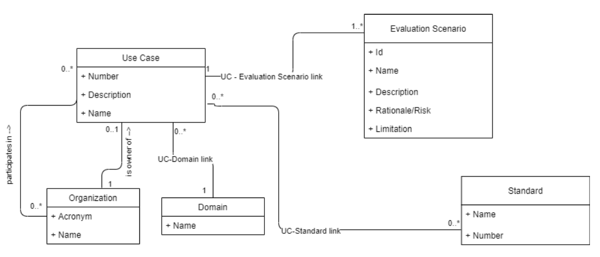

# ITS Projekt 1

- **Autor:** Jméno Příjmení
- **Datum:** 2021-04-19

## Matice pokrytí artefaktů

| Artifact | 1 | 2 | 3 | ... |
|----------|---|---|---|-----|
| Page XYZ1 | x | x |   |     |
| Page XYZ2 | x |   | x |     |
| Page ... |   |   | x |  x   |
| Setting mapping OPQR to ABCD | x |  | x | |
| Deleting XYZ | x |  | x | |
| Doing something ... | | | | x |
| Checking: relationAToB | x |  |  |  x  |
| Checking: relationXtoY |   | x | x |    |
| Checking: A covers B | x | x | x |    |
| Checking ... | | | | x |

Pokud by byl popis artefaktů příliš dlouhý, je možné tabulku rozdělit na
dvě části:

Popis artefaktů:

| Artifact Id (AId) | Artifact Description |
|-------------|----------------------|
| P\_1 | Web page for editing Use Case. |
| P\_2 | Web page for viewing list of methods |
| A\_1  | Activity for searching a method. |
| ...     | ... |

Matice pokrytí:

| AId  | 1 | 2 | 3 | ... |
|------|---|---|---|-----|
| P\_1 | x | x |   |     |
| P\_2 | x |   | x |     |
| A\_1 | x | x |   |     |
| ...  |   |   |   |     |

## Matice Feature-Test

| Feature file | 1 | 2 | 3 | ... |
|----------|---|---|---|-----|
| file1.feature | x | x | | |
| file2.feature |   |   | x | x |
| ....feature |   |   |  |   |

## Grafická reprezentace pokrytí

Tato sekce je volitelná, ale doporučená. Pokud je to možné, vybrané artefakty
zvýrazněte barvou v daných diagramech.

